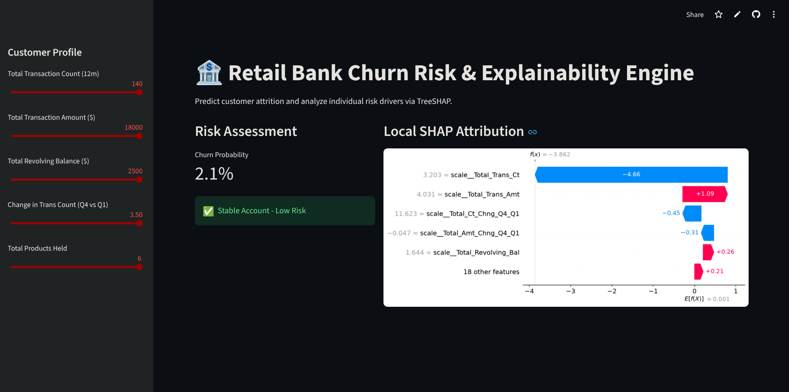

# 🏦 ChurnPulse: Retail Bank Attrition Intelligence

[](https://churnpulse-ann-v9mcvywik2speesccughyc.streamlit.app/)
[](https://www.python.org/downloads/)
[](https://xgboost.ai/)

> I built an end-to-end customer attrition system where I benchmarked a Deep Neural Network against an XGBoost ensemble, optimizing the modeling strategy around the business cost of missed churners. After selecting XGBoost as the champion model based on its superior minority-class performance, I integrated TreeSHAP for customer-level explainability and deployed the entire pipeline as an interactive Streamlit application for real-time inference.

 

## 🛠️ Tech Stack
* **Data Processing:** `pandas`, `numpy`, `scikit-learn` (`ColumnTransformer`)
* **Modeling:** `xgboost`, `tensorflow` / `keras`
* **Explainability:** `shap` (Lundberg TreeSHAP)
* **Deployment:** `streamlit`

## 📊 Model Benchmarking (Champion vs. Challenger)
I optimized for **Recall on the minority class** (flagging actual churners) and **F1-Score**, as missing a churner costs the bank significantly more than a false positive marketing intervention.

| Metric (Minority Class) | Deep Neural Network | XGBoost (Champion) |
| :--- | :--- | :--- |
| **F1-Score** | 0.82 | **0.89** |
| **Recall** | 0.87 | **0.94** |
| **Precision** | 0.77 | **0.85** |
| **ROC-AUC** | 0.971 | **0.993** |

*XGBoost outperformed the Neural Network out-of-the-box using `scale_pos_weight`, while the ANN required manual decision threshold tuning to 0.64 to remain competitive.*

## 🚀 Quick Start (Run Locally)

**1. Clone the repository and install dependencies:**
```bash
git clone https://github.com/the007prime/ChurnPulse-ANN.git
cd ChurnPulse-ANN
pip install -r requirements.txt
